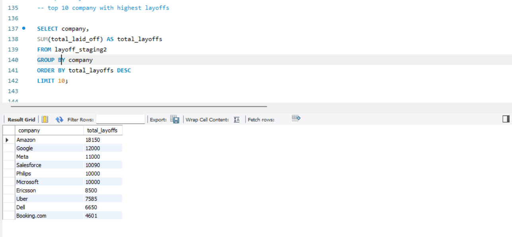
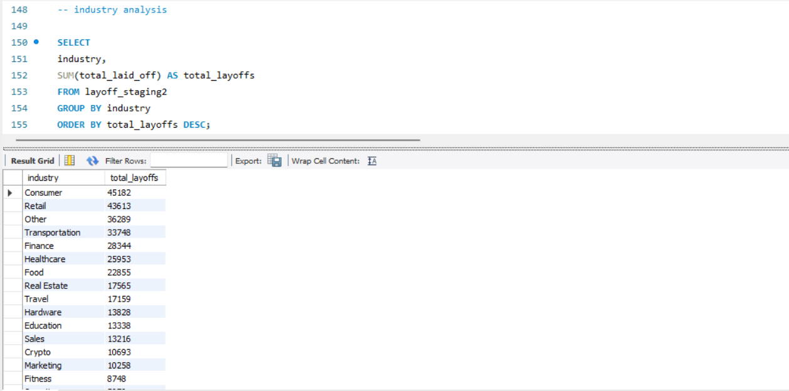
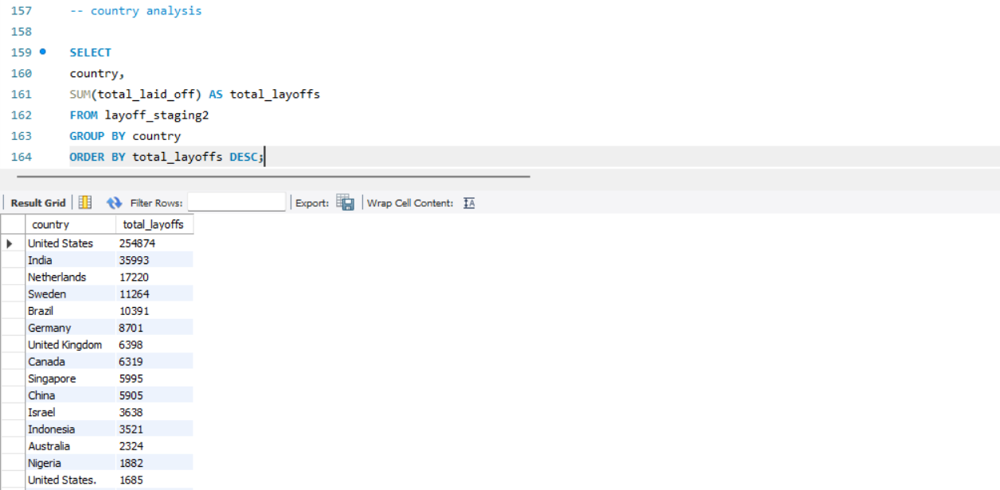
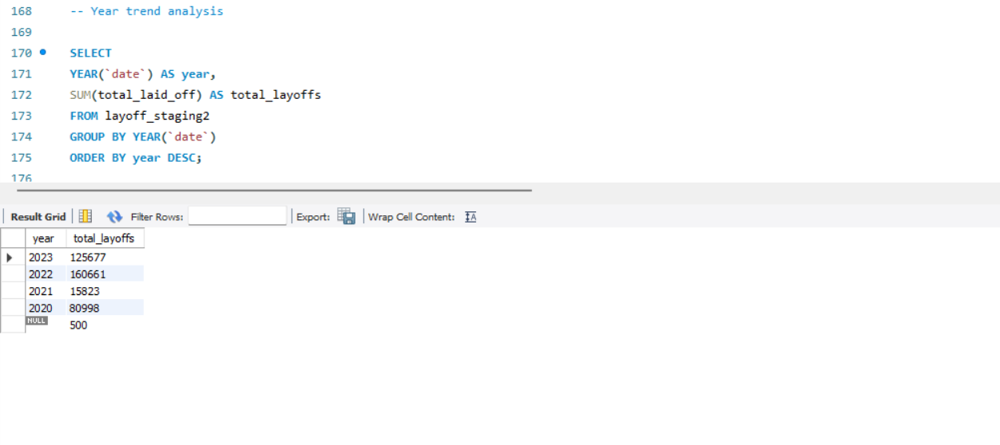

# Layoffs Data Analysis using MySQL 📊

## Project Overview

This project focuses on analyzing global company layoffs data using MySQL to identify trends, patterns, and business insights.

The cleaned dataset was analyzed using SQL queries to understand the impact of layoffs across different companies, industries, countries, and time periods.

The main objective of this project was to transform raw data into meaningful insights that can support data-driven decision making.

---

## Tools & Technologies

- MySQL
- SQL

---

## Dataset Description

The dataset contains information about company layoffs including:

- Company name
- Location
- Industry
- Total employees laid off
- Percentage of layoffs
- Layoff date
- Company stage
- Country
- Funds raised

---

## Project Workflow

### 1. Data Preparation

The dataset was cleaned and prepared before analysis.

### 2. Exploratory Data Analysis

SQL queries were used to explore the dataset and identify important patterns.

### 3. Insight Generation

Business-focused insights were extracted to understand layoffs trends.

---

## Analysis Performed

✔ Identified companies with highest layoffs  
✔ Analyzed layoffs by industry  
✔ Compared layoffs across countries  
✔ Studied yearly layoff trends  
✔ Analyzed impact based on company stage  

---

## SQL Concepts Used

- SELECT statements
- Aggregate Functions
- GROUP BY
- ORDER BY
- CTE (Common Table Expressions)
- Window Functions
- Date Functions
- Ranking Functions

---

## Key Insights

- Identified companies experiencing the highest number of layoffs
- Found industries most affected by workforce reductions
- Analyzed geographical impact of layoffs
- Studied changes in layoffs over different years

---

## Project Screenshots

### Top Companies Analysis

### Industry Analysis

### Country Analysis

### Yearly Trend Analysis

---

## Conclusion

This project demonstrates the use of SQL for data analysis and extracting meaningful insights from real-world datasets.

It helped in understanding how analysts transform raw datasets into actionable information.
